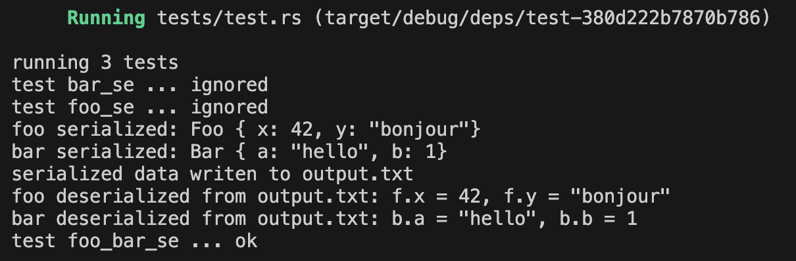

## baby_derive

用于导出 derive 属性 `BabySerialize` & `BabyDeserialize` 含有的 proc_macro `derive_serialize()` 与 `derive_deserialize()`。两个函数均以 Rust 自带的 `TokenStream` 类型为输入输出，代表着 Rust 代码的 Token 流。

### `derive_serialize()`

用于为每个指定了 `BabySerialize` 属性的 struct 生成序列化函数 `serialize()`。序列化结果形如 `Foo { x: 42, y: "bonjour"}`。

### `derive_deserialize()`

用于为每个指定了 `BabyDeserialize` 属性的 struct 生成反序列化函数 `deserialize()`。

## baby_main

用于定义 derive 属性 `BabySerialize` & `BabyDeserialize`。此外，用于向 registry() 注册每一 deserialize struct 对应的 deserialize() 函数，以便在反序列化时，令 registry() 动态获取序列化数据对应的类型，并执行反序列化。（不过最终仍然要用 downcast 指定目标类型）

## 测试结果

测试函数 `foo_bar_se` 生成了 `foo` 和 `bar` 两个实例，对应类型 `Foo` 和 `Bar`。执行序列化后，生成字符串 `s_foo` 和 `f_bar`。在将两个字符串写入文件 `output.txt` 后，测试函数读取该文件，并进行反序列化，得到 `Foo` 实例与 `Bar` 实例。